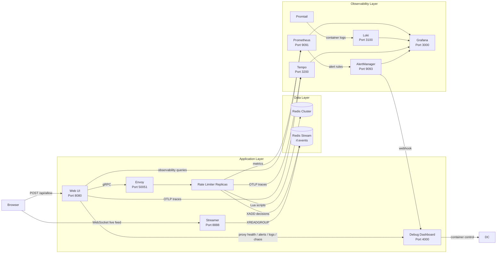

# Distributed Rate Limiter

A distributed rate limiting platform built with **Go** and **Redis Cluster**.
It enforces per-key limits across multiple service instances using **atomic Lua scripts**, then layers on a complete operational experience with a **web UI**, **live event streaming**, **metrics**, **logs**, **tracing**, **alerts**, and **chaos testing**.


## Why this project stands out

Most rate limiter projects stop at the core algorithm.
This one goes further and shows how the system behaves in a real distributed environment.

- **Correctness across replicas** using Redis-backed shared state
- **Multiple algorithms** with token bucket and sliding window support
- **Real-time visibility** into every allow/deny decision
- **Operational depth** with metrics, logs, traces, alerts, and fault injection

## What is included

| Component | Purpose |
|---|---|
| **Rate Limiter** | gRPC service that applies token bucket or sliding window rules atomically through Lua scripts |
| **Web UI** | Main interface for testing requests, viewing decisions, checking health, reading logs, and triggering chaos actions |
| **Streamer** | Consumes Redis Streams and pushes live rate-limit events to WebSocket clients |
| **Debug Dashboard** | Node.js service that powers health, alerts, logs, and chaos endpoints |
| **Envoy** | Load balances gRPC traffic across rate limiter replicas |
| **Redis Cluster** | Shared distributed state across 6 nodes (3 primaries, 3 replicas) |
| **Prometheus + AlertManager** | Metrics collection and alert routing |
| **Grafana** | Dashboards for metrics, logs, and traces |
| **Loki + Promtail** | Centralized log collection from containers |
| **Tempo** | Distributed tracing backend for request flow analysis |

## Architecture Diagram



## How a request flows

1. A client sends an `Allow` request through the **Web UI** or directly through **Envoy**.
2. **Envoy** forwards the gRPC request to one of the **rate limiter replicas**.
3. The selected replica evaluates the rule in **Redis Cluster** using an atomic **Lua script**.
4. The decision is returned immediately to the caller.
5. The replica also publishes the decision to **Redis Streams**, where the **streamer** picks it up and broadcasts it to the live event feed.

## Quick Start

### 1) Start the stack

```bash
docker compose up -d --build
```

The Redis cluster initializes automatically. Other services wait until it is ready.

### 2) Open the main services

| Service | URL | Purpose |
|---|---|---|
| **Web UI** | http://localhost:8080 | Main app: playground, live events, health, alerts, logs, chaos |
| **Streamer UI** | http://localhost:8888 | Standalone real-time event dashboard |
| **Debug Dashboard** | http://localhost:4000 | Backend service for health, logs, alerts, and chaos |
| **Grafana** | http://localhost:3000 | Dashboards, login `admin` / `admin` |
| **Prometheus** | http://localhost:9091 | Metrics explorer |
| **AlertManager** | http://localhost:9093 | Active alerts and silences |
| **Envoy Admin** | http://localhost:9901 | Proxy stats and cluster health |
| **gRPC Endpoint** | `localhost:50051` | Direct access through Envoy |

> Need different ports? Example:
>
> ```bash
> WEBUI_PORT=8081 GRAFANA_PORT=3001 docker compose up -d --build
> ```

### 3) Scale the rate limiter

```bash
docker compose up -d --scale ratelimiter=3
```

Envoy automatically balances traffic across replicas.
The live event feed shows the `instance` field so you can see which replica handled each request.

### 4) Generate traffic

```bash
chmod +x ./generate_traffic.sh
./generate_traffic.sh
```

This sends repeated requests through the Web UI gateway so you can watch decisions appear in real time.

<details>
<summary><strong>generate_traffic.sh</strong></summary>

```bash
#!/bin/bash
while true; do
  curl -s -X POST http://localhost:8080/api/allow \
    -H 'Content-Type: application/json' \
    -d '{"namespace":"myservice", "key":"user1", "rule":"5/10s", "algorithm":"AUTO", "cost":1}' > /dev/null
  echo -n "."
  sleep 0.2
done
```

</details>

## Web UI Highlights

The Web UI is the main entry point for the project.
It is designed to make both the limiter and the surrounding platform easy to understand.

### Rate-Limit Playground

- Build and send `Allow` requests interactively
- Use presets for token bucket, sliding window, and heavier request costs
- Validate rules before submission
- Preview how both algorithms behave under the same inputs
- See human-readable explanations of `allowed`, `remaining`, and `retry_after_ms`
- Keep a local request history in `localStorage`
- Copy generated `curl` and JSON examples

### Live Event Feed

- Streams every decision over WebSocket
- Shows timestamp, namespace, key, algorithm, result, remaining quota, latency, and handling replica
- Supports filtering by allowed/denied result
- Reconnects automatically if the connection drops

### Service Health, Alerts, and Logs

- Health panel for core services
- Active alerts pulled from AlertManager
- Recent logs pulled from Loki
- Chaos controls for killing or restoring containers

## API

The gRPC contract is defined in [`proto/ratelimit.proto`](proto/ratelimit.proto).

```protobuf
service RateLimitService {
  rpc Allow(AllowRequest) returns (AllowResponse);
}
```

### Request fields

| Field | Type | Description |
|---|---|---|
| `namespace` | string | Isolation scope such as `api` or `payments` |
| `key` | string | Identifier being limited, such as a user ID or IP |
| `rule` | string | Limit rule, such as `20rps` or `5/10s` |
| `algorithm` | enum | `TOKEN_BUCKET`, `SLIDING_WINDOW`, or `AUTO` |
| `cost` | int64 | Cost of the request, defaults to `1` |

### Rule formats

| Format | Algorithm | Example | Meaning |
|---|---|---|---|
| `{N}rps` | Token Bucket | `100rps` | Refill at 100 tokens per second, burst = 200 |
| `{N}/{D}s` | Sliding Window | `5/10s` | Allow 5 requests over a 10-second window |

### Response fields

| Field | Type | Description |
|---|---|---|
| `allowed` | bool | Whether the request is permitted |
| `remaining` | int64 | Remaining tokens or slots after this request |
| `retry_after_ms` | int64 | How long a denied caller should wait before retrying |
| `algorithm_used` | string | Which algorithm was actually applied |

### Example request

```bash
curl -X POST http://localhost:8080/api/allow \
  -H 'Content-Type: application/json' \
  -d '{"namespace":"api","key":"user123","rule":"20rps","algorithm":"AUTO","cost":1}'
```

## Real-Time Event Streaming

Every rate-limit decision is published to the Redis Stream `rl:events`.
The **streamer** service consumes that stream with a consumer group and broadcasts events to connected WebSocket clients.

### Stream flow

1. `ratelimiter` appends a decision with `XADD rl:events`
2. `streamer` reads entries with `XREADGROUP`
3. Events are acknowledged after delivery
4. Pending entries are reclaimed on restart
5. Slow WebSocket consumers are evicted instead of blocking the system

### Event payload

| Field | Meaning |
|---|---|
| `ts` | Unix timestamp in milliseconds |
| `ns` | Namespace |
| `key` | Rate-limit key |
| `algo` | `tb` or `sw` |
| `allowed` | `true` or `false` |
| `remaining` | Remaining tokens or slots |
| `retry_ms` | Retry-after in milliseconds |
| `latency_us` | End-to-end latency in microseconds |
| `instance` | Rate limiter replica hostname |

## Observability

This project is built to be inspectable while it is running.

### Metrics

Prometheus scrapes the services, and Grafana visualizes request rate, allow/deny split, and latency.

```promql
# Request rate
sum(rate(ratelimiter_requests_total[1m]))

# Allow / deny split
sum by (allowed) (rate(ratelimiter_requests_total[1m]))

# p95 latency
histogram_quantile(0.95, sum by (le) (rate(ratelimiter_allow_latency_seconds_bucket[5m])))
```

### Logs

Go services emit structured JSON logs with `zerolog`.
Promtail collects container logs and ships them to Loki for querying.

```logql
{service="ratelimiter"} | json | allowed="false"
{service="webui"} | json | latency_us > 1000
```

### Tracing

`ratelimiter` and `webui` export OTLP spans to Tempo, making it possible to inspect the request path from HTTP to gRPC to Redis.

### Alerts

Alert rules are defined in [`deploy/prometheus/alerts.yml`](deploy/prometheus/alerts.yml).
Examples include:

- High deny rate
- High p99 latency
- Missing rate limiter instances
- Request rate spikes

## Code Structure

```text
cmd/
  ratelimiter/        Core gRPC service
  webui/              Main HTTP server and UI
  streamer/           Redis Streams to WebSocket fan-out
services/
  debug-dashboard/    Health, logs, alerts, chaos proxy
internal/
  limiter/            Rule parsing, Redis logic, Lua scripts
proto/
  ratelimit.proto     gRPC contract
deploy/
  prometheus/         Metrics and alert rules
```

## Core Services

### `cmd/ratelimiter`

The main gRPC service. Each `Allow()` call:

1. Parses the rule
2. Selects the algorithm
3. Executes the Redis Lua script atomically
4. Records metrics
5. Emits structured logs
6. Publishes an event to Redis Streams

### `cmd/webui`

The main user-facing service. It provides:

- the single-page UI
- a JSON-to-gRPC proxy for `Allow`
- observability queries
- proxy endpoints for health, alerts, logs, and chaos controls

### `cmd/streamer`

Consumes `rl:events` and pushes decisions to WebSocket clients in real time.

### `services/debug-dashboard`

A small Node.js service that handles:

- aggregated health checks
- AlertManager proxying
- Loki log queries
- Docker-based chaos actions
- alert fan-out over WebSocket

## Configuration

Everything is configured with environment variables.
Some of the most important ones are:

| Service | Variable | Default |
|---|---|---|
| `ratelimiter` | `REDIS_ADDRS` | `redis-1:7001,...` |
| `ratelimiter` | `GRPC_ADDR` | `0.0.0.0:50051` |
| `ratelimiter` | `METRICS_ADDR` | `0.0.0.0:2112` |
| `webui` | `GRPC_TARGET` | `envoy:50051` |
| `webui` | `HTTP_ADDR` | `0.0.0.0:8080` |
| `webui` | `PROMETHEUS_URL` | `http://prometheus:9090` |
| `webui` | `DEBUG_DASHBOARD_URL` | `http://debug-dashboard:4000` |
| `streamer` | `HTTP_ADDR` | `0.0.0.0:8888` |
| `debug-dashboard` | `LOKI_URL` | `http://loki:3100` |

Host ports can be overridden at startup:

```bash
WEBUI_PORT=8081 GRAFANA_PORT=3001 PROMETHEUS_PORT=9092 docker compose up -d --build
```

## Chaos Testing

The project includes built-in failure testing so you can see how the system responds under disruption.

Available actions:

- kill a random rate limiter replica
- kill a random Redis node
- restore all exited containers

This makes it easy to demonstrate resilience, visibility, and failure recovery from the browser.

## Troubleshooting

<details>
<summary><strong>Common issues</strong></summary>

- **Port conflict**: override the host port with the relevant `*_PORT` variable.
- **Redis cluster not forming**: check `docker compose logs redis-cluster-init`.
- **Empty charts after startup**: wait a few seconds or run `generate_traffic.sh`.
- **Live event feed unavailable**: make sure port `8888` is reachable from the browser.
- **All services show red**: the debug dashboard may still be starting.
- **No logs in the UI**: Loki and Promtail may need a few seconds to ingest logs.
- **Chaos buttons fail**: confirm `/var/run/docker.sock` is mounted into the debug dashboard container.
- **Traces missing**: ensure `OTEL_EXPORTER_OTLP_ENDPOINT=tempo:4318` is set.

</details>

## Why this is a strong systems project

This project demonstrates more than a rate limiting algorithm.
It shows how to build, operate, observe, and stress-test a distributed service end to end.

That includes:

- concurrency-safe shared state
- horizontal scaling behind a proxy
- event-driven real-time updates
- observability across metrics, logs, traces, and alerts
- resilience testing through controlled failures
