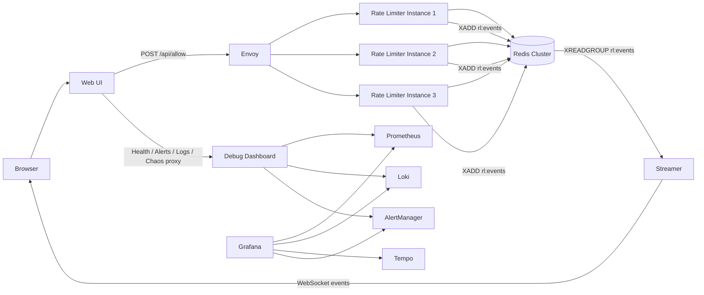

# Distributed Rate Limiter

A beginner-friendly, end-to-end system for controlling how often a user, client, or service is allowed to make requests.


## What is this project?

This project is a **distributed rate limiting platform** built with **Go**, **Redis Cluster**, **gRPC**, **WebSockets**, and a full observability stack.

In simple terms, it answers this question:

> "If many servers are running at the same time, how do they all agree on whether a request should be allowed or blocked?"

This repo solves that problem by storing shared rate-limit state in Redis and making decisions atomically with Lua scripts, so every service instance uses the same source of truth.

It also includes a browser UI, live event streaming, metrics, logs, traces, alerts, and chaos testing so you can **see the system work**, not just read the code.

---

## What is rate limiting?

Rate limiting means **controlling how frequently something can happen**.

Examples:

- A user can make **5 requests every 10 seconds**
- An API key can send **100 requests per second**
- A login endpoint can block repeated attempts to reduce abuse
- A payment service can slow down sudden traffic spikes

Without rate limiting, systems can get overloaded, abused, or become unstable.

---

## What does "distributed" mean here?

A normal rate limiter might run on **one server**.

A **distributed** rate limiter works when you have **many copies of your service running at the same time**.

That creates a challenge:

- Server A receives request #1
- Server B receives request #2
- Server C receives request #3

How do all three servers know how many requests the user has already made?

This project solves that by storing shared state in **Redis Cluster**, so every rate limiter instance reads and writes to the same distributed data store.

---

## Plain-English analogy

Think of this system like a team of security guards at multiple entrances to a stadium.

- Each guard is a **rate limiter instance**
- The stadium rule is something like: "Each person can enter only 5 times in 10 seconds"
- Redis is the **shared rule book and counter**
- Lua scripts make sure two guards do not update the counter incorrectly at the same time
- Envoy acts like the **traffic director**, sending people to whichever guard is available
- The event streamer is the **live announcer**, broadcasting each decision
- Grafana, Prometheus, Loki, and Tempo are the **control room monitors**
- The chaos tools let you **simulate failures** and watch the system recover

---

## What this project includes

This is not just a single service. It is a complete platform made of multiple parts:

- **Rate Limiter**: Go gRPC service that decides allow or deny
- **Web UI**: browser interface for testing requests and viewing system activity
- **Envoy**: load balances traffic across multiple rate limiter instances
- **Redis Cluster**: shared distributed state for counters, buckets, windows, and streams
- **Streamer**: pushes live decision events to the browser over WebSockets
- **Debug Dashboard**: helper service for health checks, logs, alerts, and chaos controls
- **Prometheus**: collects metrics
- **Grafana**: visualizes metrics, logs, traces, and alerts
- **Loki**: stores logs
- **Tempo**: stores distributed traces
- **AlertManager**: routes alerts when something goes wrong

---

## Why this project matters

This project demonstrates several real backend and distributed systems ideas:

- shared state across multiple service replicas
- atomic updates under concurrency
- load balancing
- real-time event streaming
- observability across metrics, logs, and traces
- operational debugging
- resilience and failure testing

It is useful both as a **learning project** and as a **portfolio project** because it shows much more than CRUD APIs.

---

## Architecture diagram



---

## The big idea in one sentence

The project lets multiple rate limiter servers make **consistent allow or deny decisions** by using **Redis Cluster as shared state** and **Lua scripts for atomic updates**, while giving you a full UI and observability layer to inspect everything in real time.

---

## What happens when you send one request?

Let us walk through a single request step by step.

### Step 1: You send a request

You use the browser UI or `curl` to send something like:

```bash
curl -X POST http://localhost:8080/api/allow \
  -H 'Content-Type: application/json' \
  -d '{"namespace":"api","key":"user123","rule":"5/10s","algorithm":"AUTO","cost":1}'
```

This means:

- `namespace="api"`: group or subsystem name
- `key="user123"`: the user or client being rate-limited
- `rule="5/10s"`: allow 5 requests every 10 seconds
- `algorithm="AUTO"`: let the service decide which limiter to use
- `cost=1`: this request consumes 1 unit

### Step 2: The Web UI receives it

The **web UI service** is the HTTP entry point.  
It accepts JSON from the browser and forwards the request to the internal gRPC service through Envoy.

### Step 3: Envoy load balances it

**Envoy** sits in front of the Go rate limiter services.

Its job is to route traffic across multiple replicas, for example:

- request 1 goes to instance A
- request 2 goes to instance B
- request 3 goes to instance C

This makes the system horizontally scalable.

### Step 4: A rate limiter instance handles the request

The selected **Go rate limiter service**:

1. parses the rule string
2. chooses the algorithm
3. executes a Lua script in Redis
4. gets back the result
5. returns `allowed` or `denied`

### Step 5: Redis stores the shared state

Redis is where the actual rate-limit data lives.

Depending on the algorithm, Redis stores things like:

- remaining tokens
- last refill time
- timestamps of recent requests
- counters for a time window

Because all service replicas use the same Redis cluster, they all agree on the current state.

### Step 6: Lua script makes the update atomic

This is very important.

If two requests arrive at nearly the same time, you do **not** want both of them to read stale state and both decide "allowed" when only one should pass.

Lua scripts in Redis let the read-modify-write sequence happen **atomically**.

That means the whole decision is treated as one safe operation.

### Step 7: Metrics, logs, and traces are recorded

After the decision, the system also emits observability data:

- **Prometheus metrics** for counts and latency
- **structured logs** for debugging
- **traces** for following the request path across services

### Step 8: Event is published to Redis Streams

The rate limiter asynchronously publishes an event to a Redis Stream called `rl:events`.

This event contains information like:

- who made the request
- which algorithm was used
- whether it was allowed
- how much remained
- how long it took
- which instance handled it

### Step 9: Streamer pushes it to the browser

The **streamer** service reads those events from Redis Streams and sends them to connected browsers using **WebSockets**.

That is how the live event feed updates in real time.

---

## The main parts, explained simply

## 1. Rate Limiter service

This is the core of the project.

It is a Go gRPC service with an `Allow()` API.  
Its job is to answer one question:

> Should this request be allowed right now?

It does not store rate-limit state in memory because multiple replicas need to share the same truth.  
Instead, it uses Redis Cluster.

### Responsibilities

- parse incoming rule strings
- choose token bucket or sliding window logic
- run Redis Lua scripts atomically
- return decision and retry timing
- record metrics and logs
- publish live events

---

## 2. Redis Cluster

Redis is the shared data layer.

This project uses a **6-node Redis Cluster**:

- 3 primary nodes
- 3 replica nodes

Why a cluster?

- shared state across instances
- better realism for distributed systems
- fault tolerance compared to a single Redis container
- closer to how real systems are deployed

Redis is used for two main jobs here:

### A. Rate-limit state

It stores data for token buckets and sliding windows.

### B. Event streaming

It stores the `rl:events` stream that powers the live event feed.

---

## 3. Lua scripts

Lua scripts are one of the most important technical choices in this project.

Why use them?

Because rate limiting needs **atomic decisions**.

For example:

- read current token count
- refill tokens based on time
- subtract request cost
- decide allow or deny
- write updated state back

If these happened as separate commands, race conditions could occur.

A Lua script lets Redis execute the full decision as one safe transaction-like operation.

---

## 4. Envoy

Envoy is a modern proxy and load balancer.

In this project, it sits in front of the rate limiter replicas and distributes gRPC requests across them.

Why is that useful?

- lets you scale the rate limiter horizontally
- gives one stable entry point
- helps demonstrate multi-instance behavior
- makes the system architecture more realistic

---

## 5. Web UI

The Web UI is the easiest way to interact with the project.

Instead of manually sending gRPC requests, you get a browser interface that lets you:

- submit test requests
- see allow or deny results
- watch live decision events
- inspect service health
- inspect alerts
- inspect logs
- trigger failure scenarios

This makes the project much easier to demo and understand.

---

## 6. Streamer

The streamer is responsible for the **live event feed**.

It reads decision events from Redis Streams and forwards them to the browser over WebSockets.

Why not have the browser poll?

Because WebSockets are better for real-time updates.  
The browser gets pushed updates as soon as they happen.

The streamer also supports:

- consumer groups
- pending message reclaim
- buffering for connected clients
- slow-consumer protection

So it is not just a toy WebSocket server. It behaves more like a real streaming component.

---

## 7. Debug Dashboard

The debug dashboard is a helper service.

It provides API endpoints that the browser UI can call for:

- service health
- alerts
- logs
- chaos actions
- container status

This keeps the browser UI simpler and gives one place to centralize operational functionality.

---

## 8. Prometheus

Prometheus collects **metrics**.

Metrics answer questions like:

- how many requests are happening?
- how many are allowed vs denied?
- what is the p95 latency?
- is an instance down?

Prometheus is useful because logs tell you specific stories, but metrics tell you system-level trends.

---

## 9. Grafana

Grafana is the main observability dashboard.

It visualizes data from:

- Prometheus for metrics
- Loki for logs
- Tempo for traces
- AlertManager for alerts

This gives you one place to inspect the system from multiple angles.

---

## 10. Loki

Loki stores logs.

The services emit structured JSON logs, and Promtail ships those logs into Loki.

This lets you search for things like:

- denied requests
- errors
- slow requests
- activity for a specific namespace or key

---

## 11. Tempo

Tempo stores distributed traces.

A trace lets you follow one request across the system.

For example:

- browser request enters web UI
- web UI calls Envoy
- Envoy routes to rate limiter
- rate limiter talks to Redis

Tracing helps answer:  
"Where did this request spend time?"

---

## 12. AlertManager

AlertManager handles alerts.

If Prometheus detects a problem, AlertManager routes and manages the alert.

Example alerts include:

- deny rate is unusually high
- latency is too high
- a rate limiter instance is down
- all rate limiter instances are down

---

## The two rate limiting algorithms

This project supports two common algorithms.

## Token Bucket

Think of a bucket holding tokens.

- tokens refill over time
- each request consumes tokens
- if enough tokens are available, allow the request
- if not, deny it

This is good when you want to allow short bursts while still controlling average rate.

### Example

Rule: `100rps`

Interpretation:

- refill at 100 tokens per second
- allow requests as long as enough tokens remain
- temporary bursts can still be supported depending on burst capacity

---

## Sliding Window

Think of a moving time window.

- keep track of recent request timestamps
- count how many happened in the last window
- if the count is below the limit, allow
- otherwise deny

This is good when you want a strict cap across a time window.

### Example

Rule: `5/10s`

Interpretation:

- allow 5 requests in any rolling 10-second period
- request #6 in that period gets denied

---

## Why support both?

Different systems want different behavior.

- Token bucket is often better for smoothing traffic and allowing bursts
- Sliding window is often better when you want stricter enforcement

Supporting both makes the project richer and more realistic.

---

## Why gRPC?

The internal service uses **gRPC** because it is efficient and strongly typed.

Benefits:

- clear service contract with protobuf
- fast binary transport
- common choice for internal service-to-service communication
- good fit for load-balanced backend services

The browser still uses HTTP through the web UI, so the project shows both external HTTP and internal gRPC usage.

---

## Why Redis Streams?

Redis Streams are used for the live event feed.

Why not just print logs?

Because the event feed is meant to be a structured, real-time stream of decisions that browsers can subscribe to.

Streams give:

- ordered event storage
- consumer groups
- acknowledgments
- replay and recovery behavior
- a cleaner event pipeline than raw logs

---

## Why observability is a big part of this repo

A lot of demo projects stop at "it works."

This one tries to show what operating the system looks like in practice.

That includes:

- **metrics** to measure behavior
- **logs** to inspect individual events
- **traces** to understand request flow
- **alerts** to detect problems
- **chaos testing** to simulate failures

This makes the project much closer to production-style backend engineering.

---

## Quick start

## 1. Start everything

```bash
docker compose up -d --build
```

This builds and starts all containers.

## 2. Open the main UI

Visit:

- **Web UI**: http://localhost:8080
- **Grafana**: http://localhost:3000
- **Prometheus**: http://localhost:9091
- **AlertManager**: http://localhost:9093
- **Envoy Admin**: http://localhost:9901

## 3. Scale the rate limiter

```bash
docker compose up -d --scale ratelimiter=3
```

Now Envoy can balance across multiple replicas.

## 4. Generate traffic

```bash
chmod +x ./generate_traffic.sh
./generate_traffic.sh
```

This sends repeated test requests so you can watch the system do real work.

---

## What to look at first when demoing

If someone is new to the repo, this is the easiest order to explore it.

### First

Open the **Web UI** at `http://localhost:8080`

Try sending requests manually.

### Next

Start traffic with `generate_traffic.sh`

Watch the **live event feed** update in real time.

### Then

Open **Grafana** and inspect:

- request rate
- allowed vs denied
- latency

### Then

Trigger a chaos action, such as killing one rate limiter instance, and observe:

- alerts
- health changes
- whether the system still works

This sequence makes the project much easier to understand.

---

## Example request and response

### Request

```json
{
  "namespace": "api",
  "key": "user123",
  "rule": "5/10s",
  "algorithm": "AUTO",
  "cost": 1
}
```

### Example response

```json
{
  "allowed": true,
  "remaining": 2,
  "retry_after_ms": 0,
  "algorithm_used": "sliding_window"
}
```

### What that means

- the request was allowed
- after this request, the user has 2 remaining slots in the current rule
- no wait is required before trying again
- the service used the sliding window algorithm

If the request were denied, `retry_after_ms` would tell the client how long to wait before retrying.

---

## Folder and code overview

## `cmd/ratelimiter`
Core Go gRPC service.

It handles the `Allow()` request and talks to Redis.

## `cmd/webui`
HTTP server plus browser UI.

It lets you send requests, view charts, and interact with the platform.

## `cmd/streamer`
Reads from Redis Streams and broadcasts events to browsers over WebSockets.

## `services/debug-dashboard`
Node.js service for health, alerts, logs, and chaos controls.

## `internal/limiter`
Rate limiting logic and Redis Lua integration.

Includes:

- rule parsing
- token bucket logic
- sliding window logic
- Redis client setup

## `proto/ratelimit.proto`
The protobuf contract for the gRPC API.

---

## What makes this project technically interesting

This project is more than "a rate limiter."

It combines several backend ideas into one coherent system:

- distributed coordination through shared Redis state
- concurrency-safe decision making with Lua
- horizontally scaled services behind Envoy
- gRPC for internal APIs
- streaming events to live dashboards
- metrics, logs, traces, and alerts
- failure simulation and operational debugging

That combination is what makes it stand out.

---

## When would a system like this be used in real life?

A system like this could sit in front of:

- public APIs
- login endpoints
- payment endpoints
- LLM APIs
- file upload services
- internal microservices
- partner integrations

It helps protect systems from:

- overload
- noisy neighbors
- abusive clients
- accidental traffic spikes
- unfair resource usage

---

## Beginner glossary

### Rate limiter
A system that decides how often something is allowed.

### Replica
Another copy of the same service.

### Distributed system
A system made of multiple networked services working together.

### Atomic
An operation that completes as one indivisible unit.

### Redis Cluster
A distributed Redis deployment across multiple nodes.

### Lua script
A script executed inside Redis so state changes happen safely and atomically.

### gRPC
A high-performance RPC framework using protobuf contracts.

### WebSocket
A persistent browser connection used for real-time updates.

### Metrics
Numerical measurements about system behavior.

### Logs
Detailed event records.

### Traces
Request journey records across services.

### Alert
A notification that some condition has gone wrong.

---

## Troubleshooting

### Nothing shows up in charts
Prometheus may still be scraping. Wait a few seconds and generate traffic.

### Live event feed is empty
Make sure the streamer is running and port `8888` is reachable.

### Redis cluster is not ready
Check:

```bash
docker compose logs redis-cluster-init
```

### Alerts are not showing
Make sure Prometheus and AlertManager are both healthy.

### Logs are empty
Generate traffic first, then give Loki a few seconds to ingest.

---

## Final summary

If you are brand new to distributed systems, the easiest way to think about this project is:

> It is a shared traffic-control system for requests.

Multiple servers can make safe rate-limit decisions because they all use Redis as shared state.  
Lua scripts make those decisions concurrency-safe.  
Envoy distributes traffic.  
The browser UI shows what is happening.  
The streamer broadcasts live decisions.  
The observability stack lets you inspect the system like a real production platform.

That is what this project is doing, end to end.
