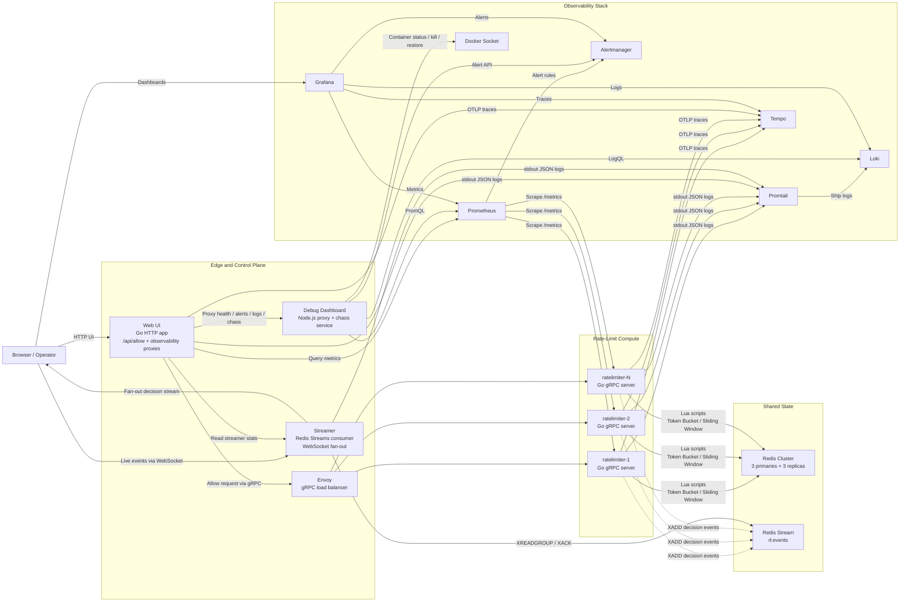

# Architecture Diagram

This diagram reflects the current runtime architecture defined in `docker-compose.yml` and the service entrypoints under `cmd/` and `services/`.

## What Happens On A Request

1. The browser submits an `Allow` check to the `webui` HTTP endpoint.
2. `webui` forwards that check to `envoy` over gRPC.
3. `envoy` load-balances the call across the `ratelimiter` replicas.
4. The selected `ratelimiter` instance executes the token bucket or sliding window Lua script against the shared Redis Cluster.
5. The `ratelimiter` instance returns the decision to `webui`.
6. The same `ratelimiter` instance also publishes a non-blocking decision event into the `rl:events` Redis Stream.
7. `streamer` consumes that event and pushes it to connected browser clients over WebSocket.

## Observability And Operations

- `Prometheus` scrapes every `ratelimiter` replica and evaluates alert rules.
- `Alertmanager` receives those alerts and exposes the active alert state.
- `Promtail` tails container logs and ships them to `Loki`.
- `Tempo` receives OTLP traces from the Go services.
- `Grafana` is pre-provisioned with `Prometheus`, `Loki`, `Tempo`, and `Alertmanager`.
- `debug-dashboard` acts as the operational sidecar for the UI: it queries metrics, alerts, and logs, and it also talks to the Docker socket for chaos actions.
- `webui` is the single browser entrypoint for operators. It serves the UI, proxies operational APIs, queries Prometheus directly for the Decision Health charts, and calls the gRPC rate limiter through Envoy.
